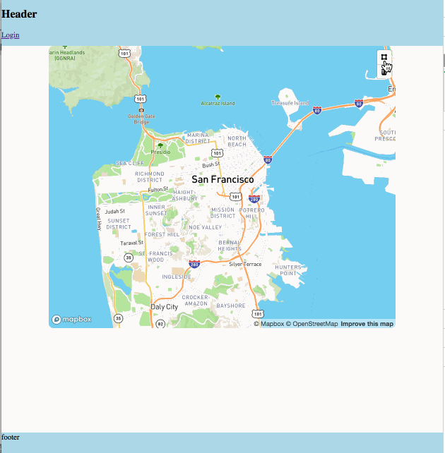

# Geofeed

Geofeed is a web app to display "moments" boxed by location & time

"moments" are content from different providers tagged with location & time, ie

  - Twitter tweets
  - Citizen alerts
  - Nextdoor posts
  - Weather Underground reports
  - ect..

"events" are collections of location & time boxed "moments"

TL;DR

## About

Illustrative rails app to build / play / scale upon.

  - rails
  - rspec
  - faker
  - vcr
  - sidekiq
  - jwt
  - webpacker
  - redux
  - react
  - ect..

concepts:

  - geo
  - design patterns
  - service object vs lib
  - api versioning
  - serialization
  - react by feature
  - redux by function
  - css modules
  - oauth
  - authenticated users
  - database modeling
  - UI
  - ect..

This repo started as my progress through rails 5 api tutorial; thanks [scotch.io](https://scotch.io/tutorials/build-a-restful-json-api-with-rails-5-part-one)! & [andela](https://github.com/andela)!

I'd like eventually rip out pure boiler plate into another repo and keep this will become a fun side project.
